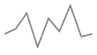
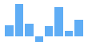
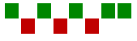
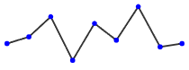

# Sparklines-react

## Install

```javascript
npm install @qumeleon/sparklines-react
````

## Quick start

### Line graph



````javascript
// your values (data)
const values = [1, 3, 9, -4, 7, 2, 12, 0, 1]

// create an element on your page which will contain the sparkline
<div style={{ width: 100, background: "#fff", padding: "5px" }}>

// render the sparkline inside the element
<SparkLinesComponent
  // set the values to be used in the sparkline
  values={values}
  // set the settings used for SparkLineGraph, this is customizable
  settings={{
    width: 100,
    height: 50,
    line: {
      stroke: {
        color: 'gray'// any valid css color name or hex/rgb(a) code
      }
    }
  }}
    // set the sparkline type
    type="SparkLineGraph"
  />

</div>
````

### Column chart



```javascript
// your values (data)
const values = [8, 23, 9, -4, 7, 21, 4, 12]

// create an element on your page which will contain the sparkline
<div style={{ width: 100, background: "#fff", padding: "5px" }}>

  // render the sparkline inside the element
  <SparkLinesComponent
    // set the values to be used in the sparkline
    values={values}
    // set the settings used for SparkLineColumnChart, this is customizable
    settings={{
      width: 100,
      height: 50,
      bars: {
       fill: {
        color: '#5fadf5'// any valid css color name or hex/rgb(a) code
      }
    }}}
    // set the sparkline type
    type="SparkLineColumnChart"
  />

</div>
```

### Win / Loss



````javascript
// your values (data)
const values = [18, -3, 9, -4, 7, -21, 4, 12]

// create an element on your page which will contain the sparkline
<div style={{ width: 100, background: "#fff", padding: "5px" }}>

  // render the sparkline inside the element
  <SparkLinesComponent
    // set the values to be used in the sparkline
    values={values}
    // set the settings used for SparkLineWinLoss, this is customizable
    settings={{
      width: 160,
      height: 40,
      bars: {
       fill: {
        colorForPositiveValues: '#008700',// any valid css color name or hex/rgb(a) code
        colorForNegativeValues: '#c00000',
      }
    }}}
    // set the sparkline type
    type="SparkLineWinLoss"
  />

</div>
````

### Line graph with markers (dots)



````javascript
// your values (data)
const values = [1, 3, 9, -4, 7, 2, 12, 0, 1]

// create an element on your page which will contain the sparkline
<div style={{ width: 100, background: "#fff", padding: "5px" }}>

  // render the sparkline inside the element
  <SparkLinesComponent
    // set the values to be used in the sparkline
    values={values}
    // set the settings used for SparkLineGraphDots, this is customizable
    settings={{
      width: 180,
      height: 60,
      line: {
        stroke: {
          color: '#333'// any valid css color name or hex/rgb(a) code
      },
      strokeWidth: 1.67, // optional
      dots: {
        fill: {
        color: 'blue', // any valid css color name or hex/rgb(a) code
      },
      size: 5
    }}}}
    // set the sparkline type
    type="SparkLineGraphDots"
  />

</div>
````
